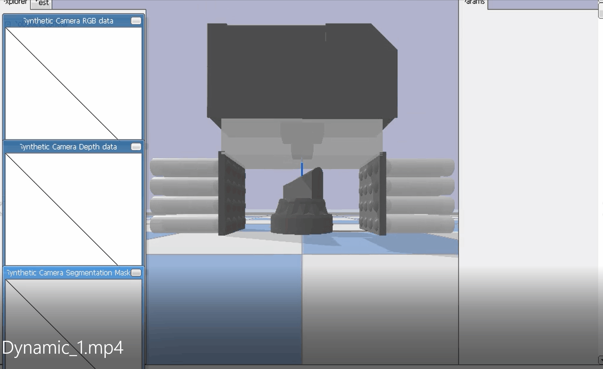

# Fit2Form: 3D Generative Model for Robot Gripper Form Design
[Huy Ha](https://www.haquochuy.com/)\*,
[Shubham Agrawal](https://bit.ly/3mSuR0d)\*,
[Shuran Song](https://www.cs.columbia.edu/~shurans/)
 
Columbia University
 
[CoRL 2020](https://www.robot-learning.org/)
 
<small>*\*denotes equal contribution*</small>

### [Project Page](https://fit2form.cs.columbia.edu/) | [Video](https://www.youtube.com/embed/utKHP3qb1bg) | [arXiv](https://arxiv.org/abs/2011.06498)
### RL policies(left) VS extending all pins (right)

<!-- 第一行 -->
|  |  |
| ------------------------------ | ------------------------------ |
| Text for Image 1               | Text for Image 2               |

<!-- 第二行 -->
|  |  |
| ------------------------------ | ------------------------------ |
| Text for Image 3               | Text for Image 4               |

<!-- 依此类推，添加更多的行 -->

### RL policies VS extending all pins

### RL policies VS extending all pins

